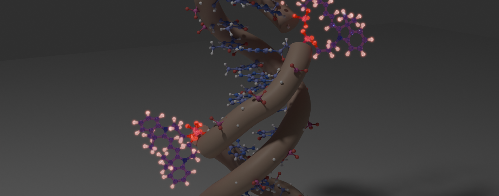

# PyeDNA 🧬



PyeDNA is a Python workflow package for building, simulating, and analyzing DNA systems with covalently attached molecular dyes and related chromophores. 

## What Is PyeDNA?

Dye-labeled DNA systems are awkward in a very specific way: the DNA is standard enough for established biomolecular workflows, but the chromophores and linkers are not. A useful simulation has to preserve the intended attachment chemistry, produce Amber-compatible parameters for non-standard residues, place the dyes in plausible three-dimensional arrangements, and keep enough bookkeeping to connect an MD trajectory back to the molecular fragments a scientist actually cares about.

PyeDNA connects those steps into one installed-package workflow driven by the `pyedna` CLI. The scientific inputs remain explicit: molecular definitions, attachment residues, force-field choices, MD settings, trajectory selections, and analysis groups live in TOML files. Machine-specific paths to Amber, HADDOCK3, NAB, and local molecular libraries live outside the repository in the runtime configuration.

The main idea is simple: turn chemically defined dye-DNA constructs into reproducible trajectories, then turn those trajectories into structural and electronic-structure observables.

## Workflow

```text
Molecular definitions
       |
       v
Create Components
       |
       v
Build DNA-dye structure
   with restrained HADDOCK3 placement
       |
       v
Amber molecular dynamics
       |
       v
Classical + quantum trajectory analysis
```

### 1. Create Components

**Input:** chemical definitions of dyes and linkers, including mapped atoms and attachment information.

Amber does not know about most synthetic dyes, linkers, or dye-linker composites by default. PyeDNA's component workflows turn these non-standard molecules into reusable simulation components. The implemented sub-workflows create dyes, create linkers, and combine existing dye/linker templates into dye-linker components.

This stage prepares molecular structures and Amber-compatible template/parameter information for local dye and linker libraries. At a practical level, the useful artifacts include MOL2 files, `frcmod` files, and attachment metadata. At the scientific level, the important result is better: a chemical definition becomes something the later structure and MD workflows can treat consistently.

**Output:** reusable dye, linker, and dye-linker component files in the configured molecular libraries.

### 2. Create Structure

**Input:** a DNA sequence or existing DNA structure, reusable dye/linker components, and the intended DNA attachment sites.

The structure workflow builds DNA systems with one or more covalently attached dyes. It can start from generated DNA or from an existing DNA structure in a library/input PDB. PyeDNA knows the intended attachment chemistry, so HADDOCK3 is used for a constrained placement problem: generate plausible three-dimensional dye/linker arrangements that satisfy the attachment restraints.

HADDOCK3 is not being asked to discover an arbitrary free-dye binding site. It is used to solve the geometry problem before final Amber topology generation. PyeDNA then reconstructs and finalizes selected docked structures, restores the needed residue/atom bookkeeping, and prepares the chosen model for Amber.

```text
DNA + dye/linker components
    -> restrained HADDOCK3 placement
    -> finalized DNA-dye structure
    -> Amber-ready topology/coordinates
```

**Output:** finalized DNA-dye PDB structures plus Amber-ready topology and coordinate files.

### 3. Run Molecular Dynamics

**Input:** Amber topology and coordinate files for the prepared DNA-dye system.

PyeDNA runs the Amber MD workflow from TOML configuration rather than from a pile of hand-maintained Amber input templates. The current MD sequence is the familiar one: minimization, equilibration, and production.

The point is not to hide Amber. The point is to make the Amber inputs reproducible, tied to the same system definition, and easy to regenerate when the construct or simulation settings change. The workflow uses Amber executables and writes standard Amber outputs, including restart/coordinate files and NetCDF trajectories for downstream analysis.

**Output:** a reproducible MD run directory containing Amber inputs, logs, restart files, and production trajectory data.

### 4. Analyze Trajectories

**Input:** an Amber topology, a NetCDF trajectory, attachment metadata, and user-defined dye/group selections.

PyeDNA analysis has two complementary sides.

Classical analysis extracts structural information from the trajectory: capped molecular snapshots, group positions, orientations, distances, centers of geometry or mass, and related geometry-driven quantities.

Quantum-mechanical analysis builds capped molecular fragments from selected trajectory frames and runs electronic-structure calculations on the dyes or dye groups. With the current PySCF/GPU4PySCF path, PyeDNA can analyze quantities such as excitation energies, oscillator strengths, transition dipoles, transition density matrices, and electronic couplings where implemented.

This MD-to-quantum bridge is one of the main reasons PyeDNA exists. The trajectory samples fluctuating molecular geometries; the quantum workflow asks how those same geometries change the electronic properties of the dye system.

**Output:** JSONL analysis records for classical observables, quantum observables, and group-to-group interaction quantities.

## Documentation

For installation, runtime configuration, TOML fields, external software requirements, and detailed workflow examples, see the project documentation:

- [Documentation overview](docs/README.md)
- [Installation](docs/getting_started/installation.md)
- [Workflow overview](docs/getting_started/workflow_overview.md)
